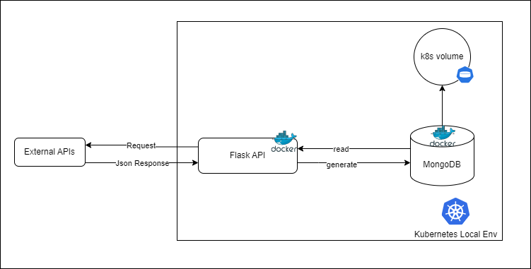

# Assignment Demo

This project is meant to showcase how you can easily build and deploy a small flask application with mongo db.

It is currently composed of the following tree:

```
.
├── Dockerfile # contains steps to build the flask api docker image
├── README.md
├── babynames-clean.csv
├── deployment # Contains yaml files used for deployments on kubernetes
│   ├── api.yaml # Flask API deployment
│   ├── mongodb.yaml # Mongo DB Deployment  
│   ├── pv.yaml # kubernetes volumes used for data persistence
│   └── secrets.yaml # api keys for the different apis
├── docs # docs and screenshots for the documentation
├── requirements.txt
├── src # core code of our Flask API
│   ├── api.py
│   └── utils.py
└── templates # templates for rendering the flask api response 
    └── index.html
```

## Design

The overall idea is to build a Flask API that triggers external apis and exchanges data with Mongo DB.
To accomplish that we perform the following:

1. Build a Flask API that triggers external API and generates information related to a random person
2. Save the record into a Mongo DB instance
3. Read records from Mongo DB on a request from the Flask API

### Application architecture:



The Flask API and Mongo DB are dockerized and deployed on a local kubernetes cluster, and a kubernetes volume is created
in order to persist data saved into Mongo DB.

## Pre-requisites

In order to run this I'm assuming you already installed:

1. docker desktop on your local machine and enabled the kubernetes feature as show by the following screenshot
   
2. kubectl command

   This is the client control command that we will use to communicate with the kubernetes cluster, here is
   the [link](https://kubernetes.io/docs/tasks/tools/install-kubectl-linux/) to install it.

## Deployment steps

1. create \<mongo\> namespace and kubernetes volumes

   `kubectl create namespace mongo`

   `kubectl apply -f deployment/pv.yaml`

2. create the mongodb instance in the \<mongo\> namespace

   `kubectl apply -f deployment/mongodb.yaml`

   You should see th following resources up under mongo namespace using `kubectl get all -n mongo`
   
3. create secrets to access the face recognition api

   `kubectl apply -f deployment/secrets.yaml`

   if you don't already have [faceplusplus](https://www.faceplusplus.com/) keys, create an account and use the new keys
   to create secrets
4. build the docker image for our api in the current context
   `docker build -t api .`
5. Before deploying the flask api, make sure you get the mongodb-service cluster-ip and add it to the
   deployment/api.yaml file under MONGO_CLIENT variable name

   

   `kubectl apply -f deployment/api.yaml`

   You should now see the api up and running

   
6. Head to a browser/postman and enter `localhost:5000/persons`/`localhost:5000/persons?id=<id>` to get the list of
   persons/a specific person's details stored in the database,
   or alternatively, `localhost:5000/generate` to randomly generate and store a person's detail in the mongodb instance

