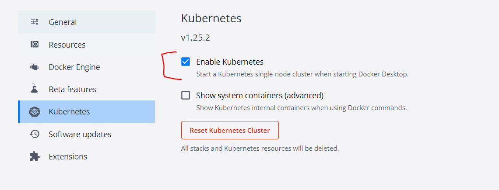
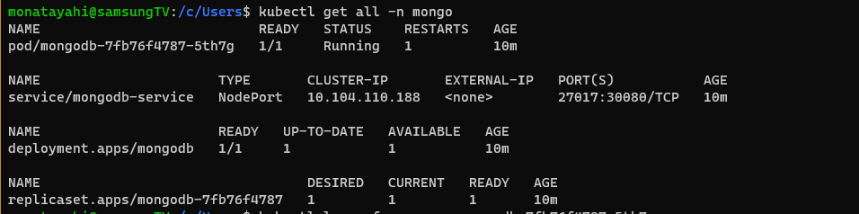
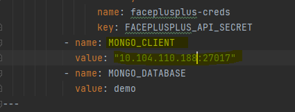
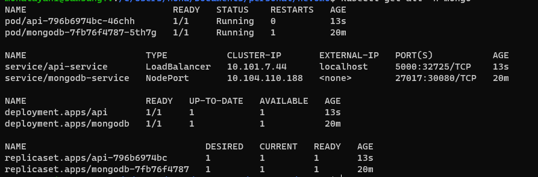

# Assignment Demo

This project is meant to showcase how you can easily build and deploy a small flask application with mongo db.

It is currently composed of the following tree: 

```
.
├── Dockerfile
├── README.md
├── babynames-clean.csv
├── deployment
│   ├── api.yaml
│   ├── mongodb.yaml
│   ├── pv.yaml
│   └── secrets.yaml
├── docs # docs and screenshots for the documentation
├── requirements.txt
├── src
│   ├── api.py
│   └── utils.py
└── templates
    └── index.html
```

## Pre-requisites
In order to run this I'm assuming you already installed:

1. docker desktop on your local machine and enabled the kubernetes feature as show by the following screenshot

2. kubectl command

    This is the client control command that we will use to communicate with the kubernetes cluster, here is the [link](https://kubernetes.io/docs/tasks/tools/install-kubectl-linux/) to install it.

## Deployment steps
1. create \<mongo\> namespace and kubernetes volumes

   `kubectl create namespace mongo`

   `kubectl apply -f deployment/pv.yaml`

2. create the mongodb instance in the \<mongo\> namespace

    `kubectl apply -f deployment/mongodb.yaml`

    You should see th following resources up under mongo namespace using `kubectl get all -n mongo`
    
3. create secrets to access the face recognition api
 
   `kubectl apply -f deployment/secrets.yaml`
4. build the docker image for our api in the current context
   `docker build -t api .`
5. Before deploying the flask api, make sure you get the mongodb-service cluster-ip and add it to the deployment/api.yaml file under MONGO_CLIENT variable name

   

   `kubectl apply -f deployment/api.yaml`

   You should now see the api up and running

   
6. Head to a browser/postman and enter `localhost:5000/persons`/`localhost:5000/persons?id=<id>` to get the list of persons/a specific person's details stored in the database,
or alternatively, `localhost:5000/generate` to randomly generate and store a person's detail in the mongodb instance

